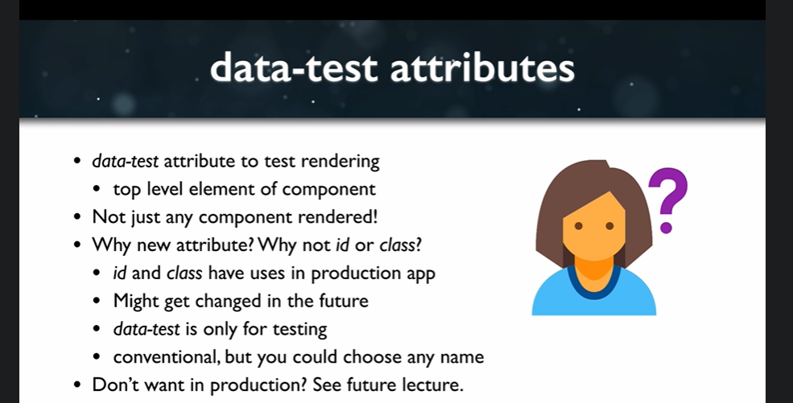

### Data Test Attributes

OK, so right now we have five passing tests, which is actually not what we want, because with TDD
we want to see failing tests first and then write code to make them pass.
So let's see if we can make those failed or red now.

Well, we could just type.
Or we could just generate a wrapper and when we generate the rapper using shallow.
```js
test('renders without error', () => {
    const wrapper = shallow(<Counter/>)
});
```
So if we do this, this is actually a decent test, if this throws an error, then the test will fail.
If this doesn't throw an error, then the test will pass.
And that's generally, you know, telling us whether or not it rendered without an error.

However, we could be more specific.
And the way that we're going to be more specific is by using a data test attribute on the component
and actually using an expected statement to throw the error.

So let's take a look at what that data test attribute is going to look like.



lets add a data test attribute to the counter component.
```js
 <div data-test="component-app" className="App">
      <h1 data-test="counter-display">
```