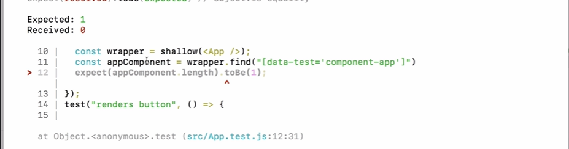

All right, so now that we know how to search for attribute values in enzyme, let's actually right
our first test to search for a data test, attribute value.
Now, what value should we use for data test?

It's good to use a standard naming convention for the container element for every component.
That way you don't have to think about it and go back and forth.

That way you don't have to think about it and go back and forth.
You just know that that's how you name your container elements.
The standard that we're going to use is we're going to use Kabab case and we'll start with component.

The Kabab cases, this little dash.

I like to think of all the words skewered on a kaibab, so we'll do component and then the name of the
component, which in this case is AMP.

for now we are not going to finish the data-test attribute name, as we want to make our test case fail first so for now we can just leave the data-test attribute name as is.

```js
 <div data-test="component-app" className="App">
```

now we can find the data test attribute in our test file like so,
```js
const appComponent = wrapper.find("[data-test='component-app']");
```

**Remember to not have spaces in the data test attribute.**

now we can make an assertion using the `expect` keyword, and try and make our test fail.

```js

 expect(appComponent.length).toBe(1);

 ```

 now when we run our test, we should see an error. 

 

 now we want the tests to pass so let's add in the name
 
 ```js
 <div data-test="component-app" className="App">

 ```